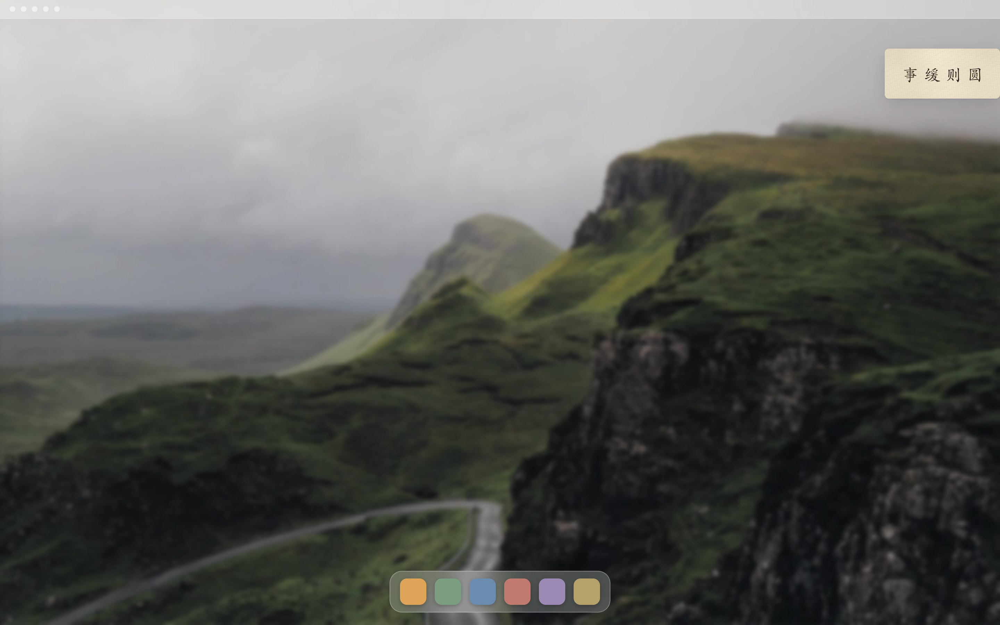
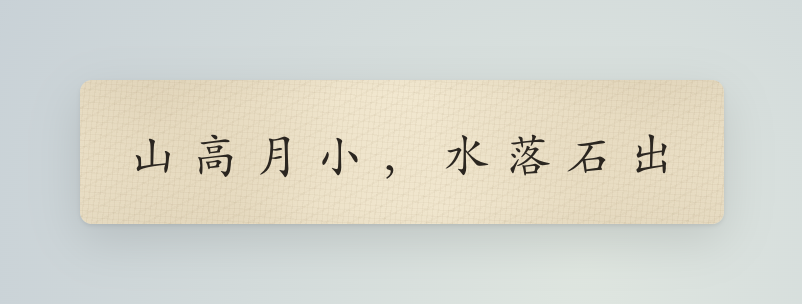
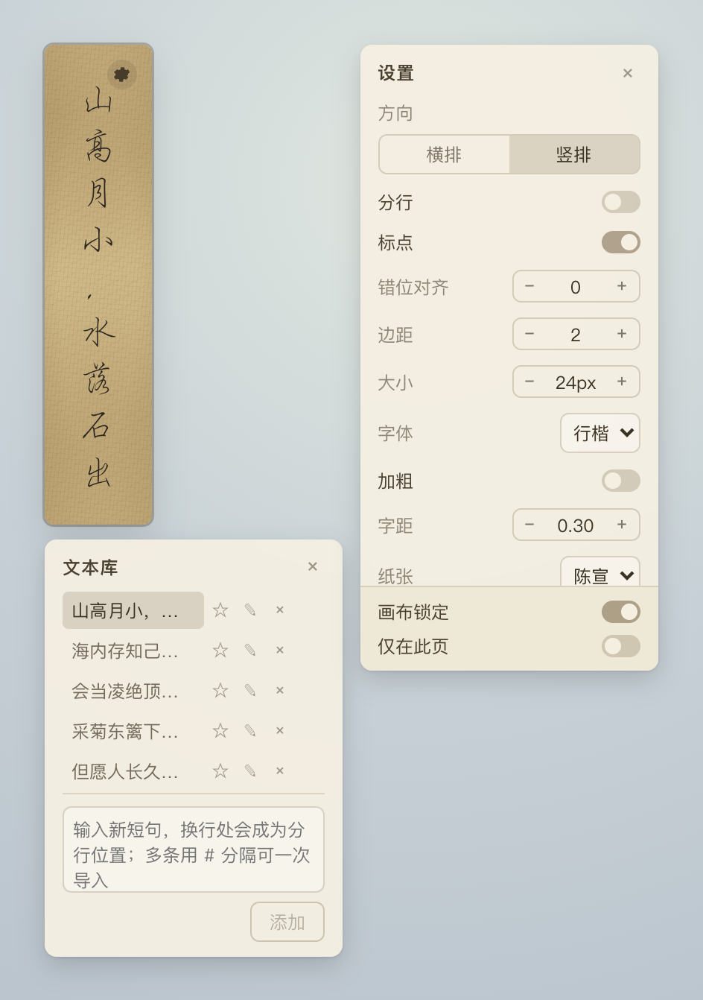

# 桌面书法 Desktop Calligraphy

一个常驻桌面的书法摆件：无边框、透明背景的小卡片，展示古典诗文，可自由拖动、切换字体/纸张/排版，支持一个文本库轮播多条短语。基于 Tauri 2 + React + TypeScript 开发，仅使用 macOS 系统自带的中文字体，不依赖任何外部字体文件。

A small always-on-top macOS desktop ornament that displays classical Chinese calligraphy phrases on a borderless, transparent "rice paper" card. Built with Tauri 2 + React + TypeScript.

<p align="center">
  
</p>

## 功能

- 横排 / 竖排，可选是否分行、是否保留标点
- 楷体、宋体、黑体、行楷、隶书、汉隶、仿宋、魏碑、圆体等系统字体，可加粗、可调字距
- 米宣 / 青宣 / 陈宣 / 素白等纸张质感，透明度可调
- 文本库：手动切换、正序/倒序/随机/收藏轮播，支持自定义切换频次与批量导入，内容会永久保存在本地，重启软件也不会丢
- 双击画布解锁后可拖动，移到任意位置；默认在所有 macOS 虚拟桌面（Spaces）下都保持可见，也可以设为仅在当前桌面显示
- 精简过的原生菜单栏（只有「设置」和「退出」）

<p align="center">
  
  &nbsp;&nbsp;
  
</p>

## 下载使用

在本仓库的 [Releases](../../releases) 页面下载最新的 `.dmg`，双击挂载后把 App 拖进「应用程序」文件夹即可。

> 因为没有 Apple 开发者签名，第一次打开时 macOS 会提示"来自身份不明的开发者"。在「访达」里找到这个 App，右键点击 → 选择「打开」，在弹出的确认框里再点一次「打开」，之后就能正常双击启动了。

支持 Apple Silicon 与 Intel 芯片的 Mac。

## 从源码运行 / 构建

需要 [Node.js](https://nodejs.org/)（18+）和 [Rust](https://www.rust-lang.org/tools/install)。

```bash
npm install
npm run tauri dev    # 本地调试
npm run tauri build  # 打包出 .app / .dmg，产物在 src-tauri/target/release/bundle
```

## 技术栈

Tauri 2 · React 19 · TypeScript · Vite

## License

MIT
